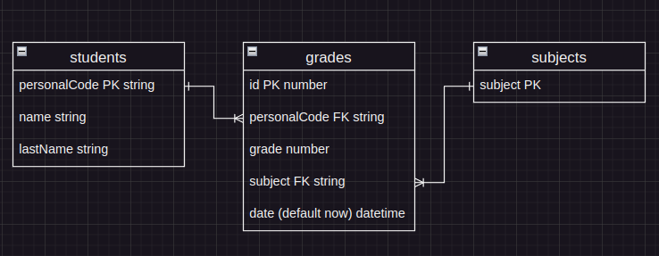

# студенты и оценки . тестовое задание

описание задания в файле <a href="https://github.com/S-404/students_grades_test_task/blob/master/TASK_description.md" target="_blank">TASK_description.md</a>

## подготовка .env файла

можно взять за основу файл .env.example \
следует указать актуальный <i style='color: orange'>POSTGRES_HOSTNAME</i> \
остальные значения можно оставить как есть 

.env файл должен находится в корневой директории

    PORT=8080
    
    POSTGRES_DB=students_grades
    POSTGRES_USER=postgres
    POSTGRES_PASSWORD=mysecretpassword
    POSTGRES_HOSTNAME=192.168.1.23
    POSTGRES_PORT=5432

    NATS_SERVER=192.162.246.63:4222

# запуск приложения

## в докере

    docker compose up

 
 или вручную

## установка зависимостей:

    npm ci

## подготовка базы данных:

необходимо создать postgres базу данных "students_grades"

    # createdb students_grades -U postgres      

## запуск миграций

    npx sequelize-cli db:migrate

## запуск приложения

    npm run dev

# server-api

### <i style='color: green'>get</i> /log?[параметры_пагинации]

параметры_пагинации:
    
    limit?: number;
    offset?: number;

результат :

    [
        {
            date:string // дата-время получения оценки в ISO-формате
            subject:string // код предмета
            grade:number // полученная оценка
            student: {
                personalCode:string // персональный код студента
                name:string // имя студента
                lastName:string // фамилия студента
            }
        },
        ...
    ]

### <i style='color: green'>get</i> /statistic/:personalCode

Результат:

    {
        student: {
            personalCode:string // персональный код студента
            name:string// имя студента
            lastName:string// фамилия студента
        },
        statistic: [ // массив инфы по предметам, включая те, по которым у студента не было оценок
            {
                subject:string // код предмета
                maxGrade:number // максимальная оценка
                minGrade:number // минимальная оценка
                avgGrade:number // средняя оценка (дробное число)
                totalGrades:number // всего получено оценок
            },
            ...
        ]
    }

# мои комментарии:

при запуске приложения производится подписка (nats) на получение данных с сервиса\
при получении данных об оценке по подписке <i>students.v1.graded</i>\
проверяется есть ли запись в бд о студенте получившим оценку.\
если нет - то осуществляется запрос <i>students.v1.get</i>.

### отношения

полученные данные (nats)\
о <b>студенте</b> записываются в таблицу <i>Students</i>\
об <b>оценке</b> в таблицу <i>Grades</i>\
также осуществляется запись <b>предмета</b> в таблицу <i>Subjects</i> 
<i style='color: grey'>(в целом можно было обойтись и без этой сущности, 
но если рассматривать возможность расширения - 
эту сущность можно связать с преподавателями, аудиториями, факультетами и т.д.)</i>

при неудачной попытке получения данных о студенте - \
будет производиться запись дефолтного студента (unknown). \
с рассчетом на то, что осуществление доп. запросов для синхронизации данных можно произвести позже.
<i style='color: grey'> настроить в том же cron таску с запросами данных по студентам отмеченных как "unknown" (или любым другим флагом) </i>

### statistic
запрос на получение статистики я решил оставить в чистом sql - такое решение как мне кажется лаконичнее.
т.к. на выходе результат аггрегации данных, такие операции проще сделать в sql синтаксисе, чем выбирать данные по частям и писать алгоритмы со вложенными циклами для обработки полученных данных.
<i style='color: grey'> данное мнение не является неизменным. легко подвергается критике :)</i>

### что можно было бы улучшить:

улучшил бы пагинацию, точнее результат ответа на ендпойнте log.\
для более качественной реализации пагинации на клиенте я бы в результат добавил информацию об общем количестве данных.\
в таком виде:

    {
        totalRecords: 100,
        offset: 30,
        limit: 10,
        data: [...//данные//...]
    }

также следовало бы добавить больше контроля за подключением nats, \
добавить обработку сценария где сервис nats не доступен, \
т.е. следует добавить проверки статуса сервиса с периодическими попытками переподключения.
